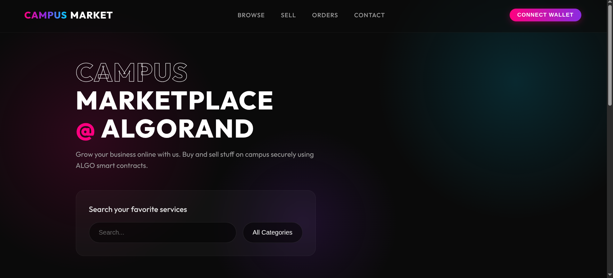
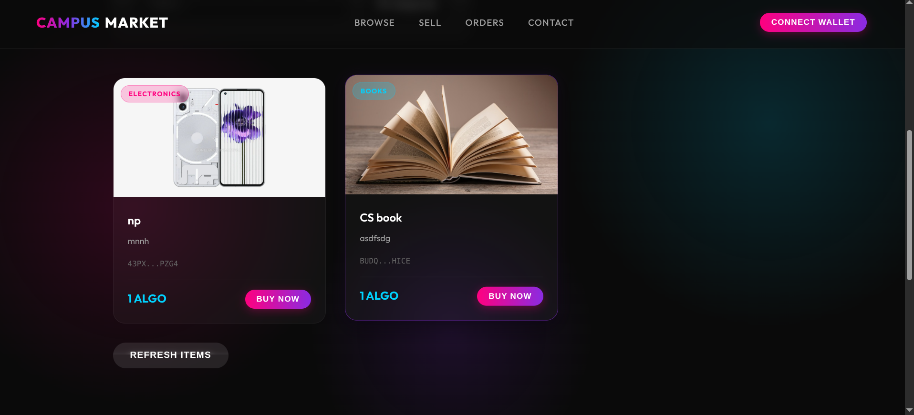
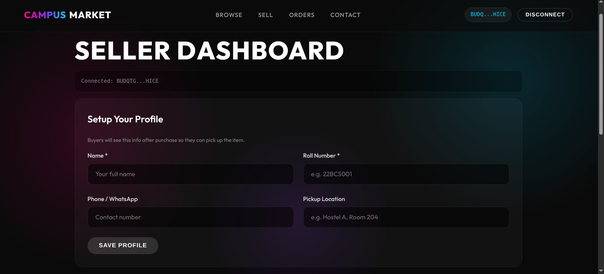
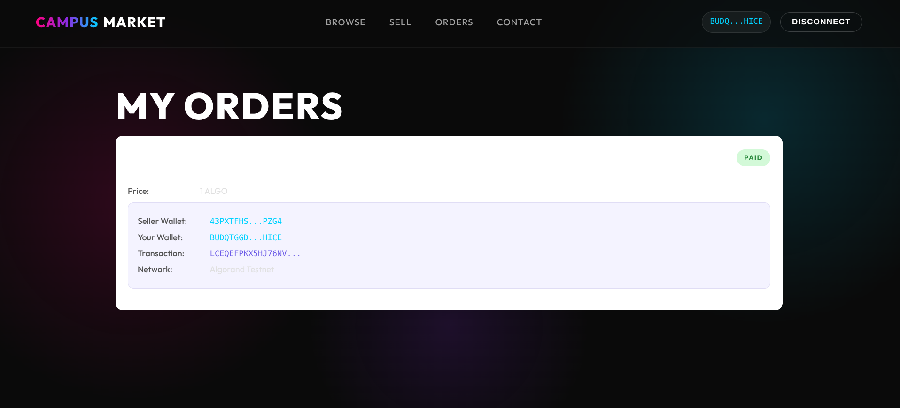

# Campus Marketplace - Crypto Payments on Algorand

A peer-to-peer campus marketplace where students buy and sell items (books, electronics, furniture) and pay with **ALGO** on the **Algorand blockchain**. Transactions are instant, transparent, and verifiable on-chain. Buyer and seller profiles (name, roll no., phone, pickup location) are exchanged after purchase so items can be picked up in person.

---

## Problem Statement

**PS4 - Algorand Web3 Track:**  
Build a peer-to-peer marketplace where students can buy and sell items using ALGO or stablecoins. The platform includes product listings, search functionality, and integrated crypto checkout.

---

## Live Demo

**https://campus-market-one.vercel.app/**

---

## Demo Video

**LinkedIn:** 

---

## Smart Contract - App ID (Testnet)

| Field | Value |
|-------|-------|
| **App ID** | **755802245** |
| **Explorer** | [View on Testnet Explorer](https://testnet.explorer.perawallet.app/application/755802245) |
| **Contract** | [`smart_contracts/marketplace/contract.py`](smart_contracts/marketplace/contract.py) |
| **Language** | Algorand Python (Puya / algopy) |


---

## How it works

1. **Seller** connects Pera Wallet, fills out their profile (name, roll number, phone, pickup location), and lists an item with a price, image, and description.
2. Item data is saved to Firebase Firestore. The image is saved to Cloudinary.
3. **Buyer** browses items, picks one, connects their wallet, and enters their contact info.
4. Buyer clicks "Pay" and Pera Wallet signs an ALGO payment transaction which is sent to the Algorand Testnet and confirmed on the blockchain.
5. The order is saved to Firestore with the **on-chain transaction ID** and the buyer and seller contact info.
6. The buyer sees a **blockchain receipt** (transaction ID, wallets, amount) and the **seller's pickup info**.
7. The seller sees **incoming orders** with the buyer's name, roll number, and phone number so they can arrange to hand off the item.

---

## Tech Stack

| Layer | Technology | Purpose |
|-------|-----------|---------|
| Frontend | **React 18** + **Vite** | Single-page app, code-split lazy loading |
| Styling | Plain CSS | Responsive, no framework overhead |
| Blockchain | **Algorand Testnet** | ALGO payment transactions |
| Smart Contract | **Algorand Python (Puya / algopy)** | On-chain marketplace logic |
| Wallet | **Pera Wallet** (`@perawallet/connect`) | Transaction signing |
| SDK | **algosdk v3** | Build & send Algorand transactions |
| Database | **Firebase Firestore** | Items, orders, user profiles (with offline cache) |
| Images | **Cloudinary** | Upload & CDN for product photos |
| Hosting | **Vercel** | Auto-deploy from GitHub |
| RPC Node | **AlgoNode** (free) | Algorand testnet API - no API key needed |

---

## Installation & Setup

### Prerequisites

- **Node.js 18+**
- **Pera Wallet** mobile app (set to Testnet) - [Download](https://perawallet.app/)
- **Test ALGO** from the faucet: https://bank.testnet.algorand.network
- **Firebase** project with Firestore enabled
- **Cloudinary** account (free tier) with an **unsigned** upload preset

### Clone & Install

```bash
git clone https://github.com/Adarshkumar76/campusMarket.git
cd campusMarket/frontend
npm install
```

### Configure Environment

Create `frontend/.env`:

```env
# Firebase
VITE_FIREBASE_API_KEY=your_key
VITE_FIREBASE_AUTH_DOMAIN=your_project.firebaseapp.com
VITE_FIREBASE_PROJECT_ID=your_project_id
VITE_FIREBASE_STORAGE_BUCKET=your_project.appspot.com
VITE_FIREBASE_MESSAGING_SENDER_ID=your_sender_id
VITE_FIREBASE_APP_ID=your_app_id

# Cloudinary
VITE_CLOUDINARY_CLOUD_NAME=your_cloud_name
VITE_CLOUDINARY_UPLOAD_PRESET=your_unsigned_preset

# Algorand (optional - used in smart contract deploy)
VITE_ALGORAND_APP_ID=755802245
```

### Run Locally

```bash
npm run dev
```

Open **http://localhost:5173** in your browser.

### Build for Production

```bash
npm run build    # outputs to frontend/dist/
npm run preview  # preview production build locally
```

---

## Usage Guide

### 1. Connect Wallet
Open the app, click **Connect Wallet**, and approve it in your Pera Wallet.

### 2. Sell an Item
Go to the **Sell** tab, fill in your profile (name, roll number, phone, pickup location), add the item title, price (in ALGO), description, and image, then click **List Item**.

### 3. Browse & Buy
Go to the **Browse** tab, search or filter by category, click **Buy Now**, enter your name and roll number, click **Pay X ALGO**, and approve the transaction in your Pera Wallet.

### 4. After Purchase
- **Buyer** sees a blockchain receipt (Transaction ID, wallets, amount) and the seller's contact info for pickup.
- **Seller** sees an incoming order with the buyer's name, roll number, and phone number on their dashboard.

### 5. Track Orders
Go to the **Orders** tab to see all your past purchases with blockchain transaction links.

### Screenshots






---

## Known Limitations

- Smart contract deployed to testnet (App ID: 755802245) - marketplace uses direct ALGO payment transactions which are fully on-chain
- No escrow - payment goes directly from buyer to seller wallet
- No user authentication beyond wallet address
- Images stored on Cloudinary, not IPFS/on-chain
- Only supports ALGO payments (no ASA stablecoin support yet)
- Minimum balance requirement: accounts must keep 0.1 ALGO, so buying a 1 ALGO item requires ~1.101 ALGO

---

## Team Members

| Name | Role |
|------|------|
| **Adarsh Kumar** | Full-Stack Developer - Frontend, Smart Contract, Blockchain Integration |
| _Add teammate_ | _Role_ |

---

## References

- [Algorand Developer Docs](https://developer.algorand.org)
- [AlgoKit Documentation](https://developer.algorand.org/algokit/)
- [algosdk v3 Migration Guide](https://github.com/algorand/js-algorand-sdk)
- [Pera Wallet Connect](https://github.com/perawallet/connect)
- [Testnet Faucet](https://bank.testnet.algorand.network)
- [Testnet Explorer](https://testnet.explorer.perawallet.app)
- [Firebase Firestore Docs](https://firebase.google.com/docs/firestore)
- [Cloudinary Docs](https://cloudinary.com/documentation)
